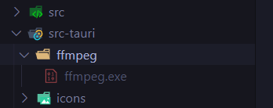

# motions

a stop-motion-studio

## Develop Locally (windows)

- Get the prerequisites for the development - _Microsoft Visual Studio C++ Build Tools_, _WebView2_ and _Rust_ - [prerequisites link](https://tauri.app/v1/guides/getting-started/prerequisites/)

- Clone the repository and install dependencies

  ```bash
  git clone https://github.com/ish-u/motions
  cd motions
  npm install
  ```

- Get `ffmpeg` binary for windows from this link - [ffmpeg windows-64](https://ffbinaries.com/downloads)

- Copy the extracted `ffmpeg.exe` file to `src-tauri\ffmpeg`

  

- Be sure to have [Tauri Extension](https://marketplace.visualstudio.com/items?itemName=tauri-apps.tauri-vscode) and
  [rust-analyzer](https://marketplace.visualstudio.com/items?itemName=rust-lang.rust-analyzer)

- Start the Application

  ```bash
  npm run tauri dev
  ```

  

## Download - [GitHub Releases](https://github.com/ish-u/motions/releases)
